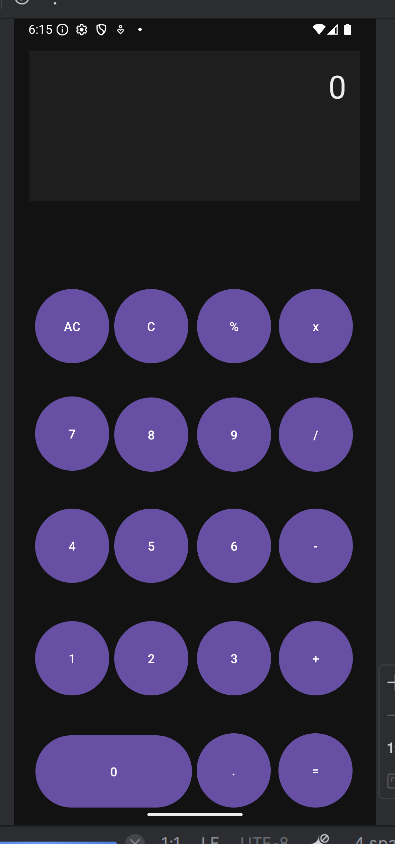
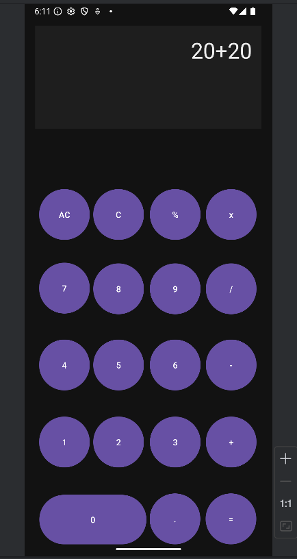

# 📱 Calculator App

A simple calculator Android application built in **Java** using **Android Studio**.

## ✨ Features
- Addition, subtraction, multiplication, and division
- Clear and reset functionality
- Simple and clean UI

## 📸 Screenshots


 

## 🚀 Installation
1. Clone the repository:
   ```bash
   git clone https://github.com/rahulwalaw/Calculator.Apk.git
